# hello-devops-world1111
שלב 1
בדיקת הגרסאות של כלל האפליקציות דרך הטרמינל בפקודה --VERSION

שלב 2 
יצירת קובץ app.py שמדפיס הודעת פתיחה- Hello DevOps World ופתיחת בריץ חדש שבו יהיה העדכון גירסה
 העלאת הקוד לגיט תוך שימוש בפקודת פוש 
 
שלב 3
- יצירת בריץ חדש והרצת עדכון תוכנה
שלב 4 
יצירת תיקית בשם .github/workflow תוך שימוש בקובץ מסוג yml שבעזרתו מתבצע חיבור לgithub action 
האוטומציה תרוץ בעזרת הפקודות- 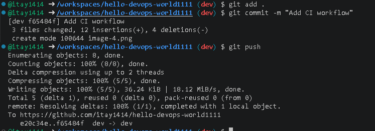
שלב 5
בידקת הCI והקרסת ושבירת הYML בעזרת שבירת הזחה 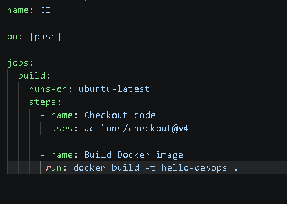
תוצאה -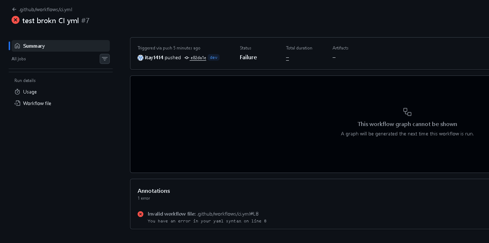
החזרת syntx תקינה -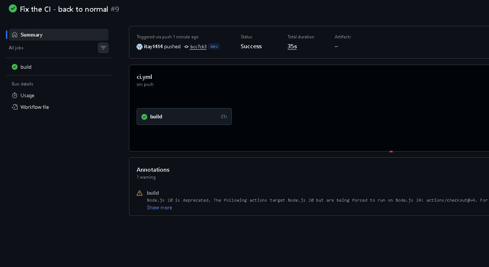
שלב 6 
יצירת אוטומצית CD לטובת פריסת קוד!
[alt text](image-11.png) 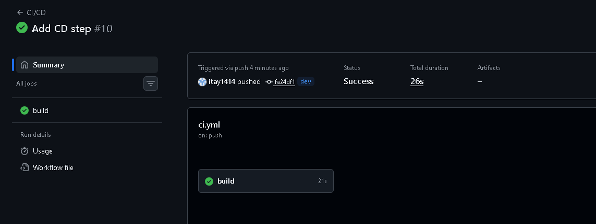
חלק ב
כתיבת הקוד במשימה בשילוב של ספריות שונות 
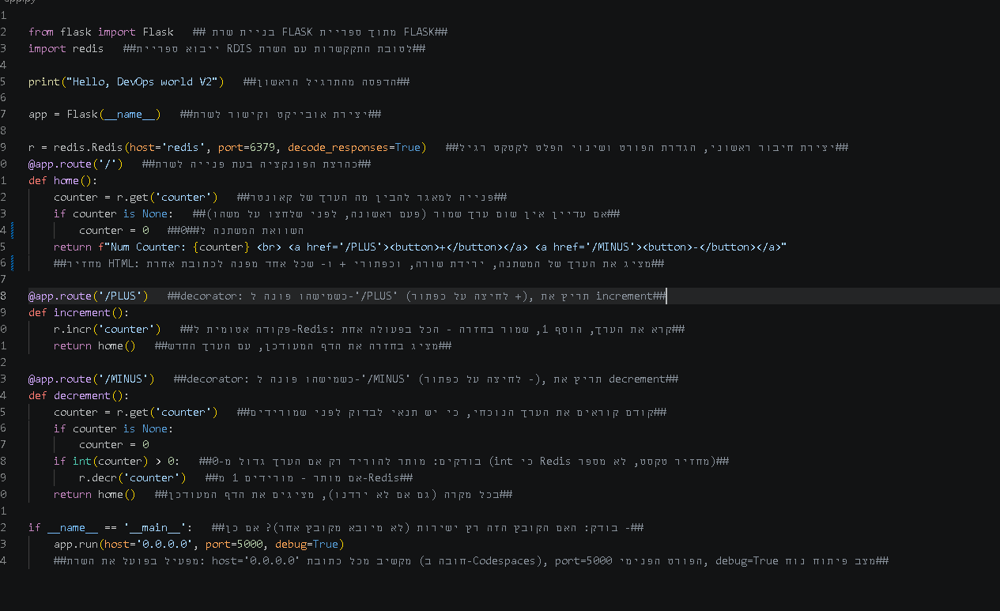
שלב 8
הוספת פקודת ה pip install לDOCKERFILE לטובת יצירת אוטומציה להתקנת הספריות הרלוונטיות
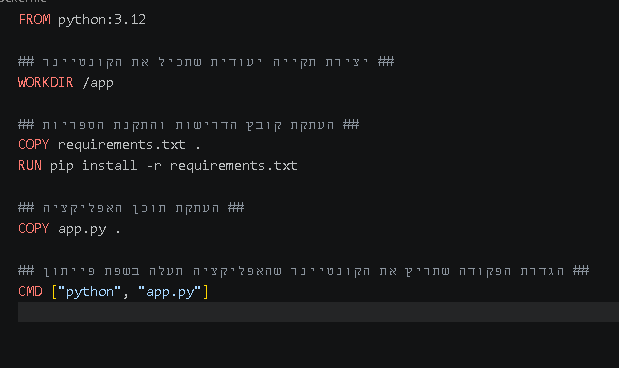
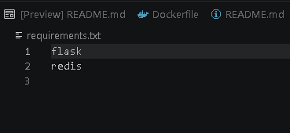
שלב 9 
כתיבת compose לטובת הרצת שני קונטיינרים במקביל
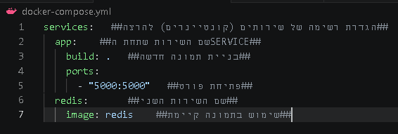
שלב -10 
הרצת האפליציה- חיבור השרתים עם הDB והרמת האפליקציה
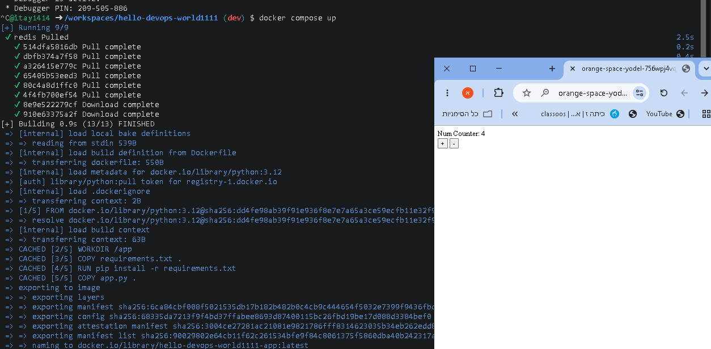
שלב 11-
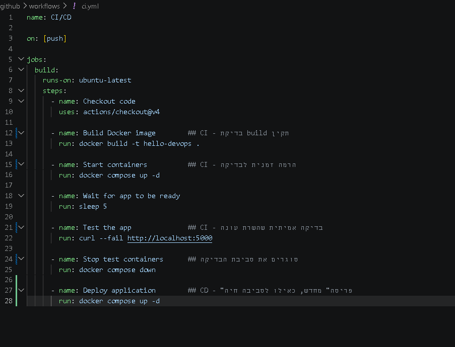- עדכון yml file בהתאם לאוטומוציה הרלוונטית לאפליקציה 