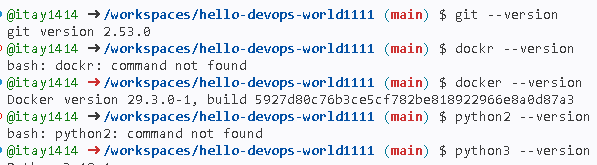
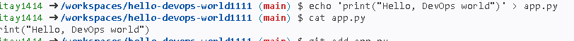
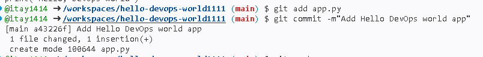
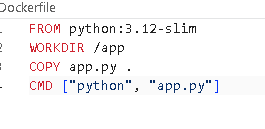
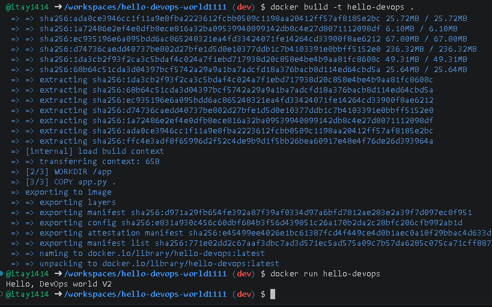

# hello-devops-world1111
שלב 1
בדיקת הגרסאות של כלל האפליקציות דרך הטרמינל בפקודה --VERSION

שלב 2 
יצירת קובץ app.py שמדפיס הודעת פתיחה- Hello DevOps World 

שלב 3 
כתיבת dockerfile שעליו תיבנה התמונה והרצת קונטייר דרך פקודת docker run
- ביצוע "צילום למסך" לטובת שמירת הקוד במידה ונרצה לחזור אילו
-תוכן ה dockerfile
- הרצת האפליקציה
שלב 4 
יצירת תיקית בשם .github/workflow תוך שימוש בובץ מסוג yml(ניתן לגדיר כקובץ הגדרות למשחב) שבעזרתו מתבצע חיבור לgithub action 
האוטומציה תרוץ בעזרת הפודות- 